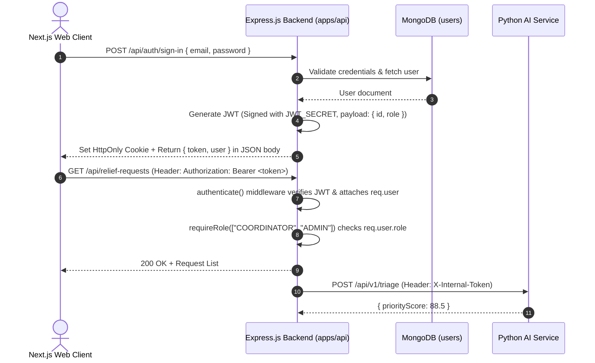
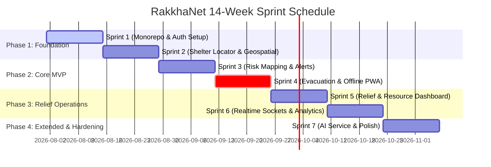

# RakkhaNet — AI-Powered Disaster Response & Relief Coordination Platform
## Master Implementation Blueprint & Architecture Guide

> **Document Status:** Living Blueprint  
> **Target Audience:** Engineering Team (Kareeb, Nahian, Rohan, Arpon) & Project Stakeholders  
> **Timeline:** 14 Weeks (7 Sprints × 2 Weeks)  

---

## 1. Monorepo Architecture & Folder Structure

RakkhaNet uses a **pnpm Workspaces + Turborepo** monorepo setup. This architecture ensures unified type safety across frontend and backend, atomic commits, shared Zod boundary validations, and efficient build caching across all services.

```text
rakkhanet/
├── apps/
│   ├── web/                        # Next.js 14 App Router Frontend
│   │   ├── src/
│   │   │   ├── app/                # App Router Pages & API Proxies
│   │   │   ├── components/         # UI Components (shadcn/ui, Maps, Dashboards)
│   │   │   ├── hooks/              # Custom Hooks (React Query, Geolocation, Socket)
│   │   │   ├── stores/             # Zustand Global State (Auth, Active Shelter, Map Filters)
│   │   │   ├── lib/                # API client, Leaflet icons, utils
│   │   │   └── types/              # Frontend-specific UI types
│   │   ├── public/                 # Static assets, PWA manifest, service workers
│   │   ├── next.config.js          # Next.js config (next-pwa setup)
│   │   └── package.json
│   │
│   ├── api/                        # Express.js Backend Service
│   │   ├── src/
│   │   │   ├── config/             # DB connection, Env validation, Better Auth setup
│   │   │   ├── controllers/        # Route Handlers
│   │   │   ├── middleware/         # Auth, RBAC, Error Handler, Zod validation
│   │   │   ├── models/             # Native MongoDB Driver DAO / Collection collections
│   │   │   ├── routes/             # Express Router definitions
│   │   │   ├── services/           # Business logic (Evacuation, Geospatial, Socket emitting)
│   │   │   ├── sockets/            # Socket.io event handlers
│   │   │   └── index.ts            # Express App entrypoint
│   │   └── package.json
│   │
│   └── ai-service/                 # Python 3.11 FastAPI Microservice (Extended)
│       ├── app/
│       │   ├── api/                # FastAPI Routers
│       │   ├── core/               # App configuration & ML settings
│       │   ├── models/             # Risk scoring heuristics & NLP triage pipeline
│       │   └── main.py             # FastAPI entrypoint
│       ├── requirements.txt
│       └── Dockerfile
│
├── packages/
│   ├── shared-types/               # Shared TypeScript interfaces & Zod Schemas
│   │   ├── src/
│   │   │   ├── schemas/            # Zod schemas for all 7 MongoDB collections
│   │   │   ├── dtos/               # Request & Response DTO schemas
│   │   │   └── index.ts
│   │   └── package.json
│   │
│   ├── config-ts/                  # Shared tsconfig definitions
│   │   ├── base.json
│   │   ├── nextjs.json
│   │   └── express.json
│   │
│   └── config-eslint/              # Shared ESLint rules
│
├── package.json                    # Root scripts & Turborepo workspace config
├── pnpm-workspace.yaml             # pnpm workspace definition
├── turbo.json                      # Turborepo task pipeline execution graph
└── implementation.md               # Master Project Blueprint (This Document)
```

### Architectural Justification
1. **Shared Types (`packages/shared-types`):** Zod schemas are compiled once and imported by both `apps/web` and `apps/api`. This guarantees 100% end-to-end type safety and prevents API schema drift.
2. **Decoupled API & Frontend:** Separating `apps/api` (Express) from `apps/web` (Next.js) prevents Next.js serverless connection pool exhaustion on MongoDB Atlas and allows Socket.io stateful persistent WebSocket connections for real-time disaster alerts.
3. **Isolated Python Microservice:** Python FastAPI (`apps/ai-service`) runs independently. If ML triage high-memory jobs spike, main backend CRUD & shelter search APIs remain unaffected.

---

## 2. Environment & Tooling Setup

### Prerequisites
- **Node.js:** `v20.x LTS`
- **Package Manager:** `pnpm v9.x`
- **Python:** `3.11+` (for `apps/ai-service`)
- **Database:** MongoDB Atlas instance (with 2dsphere indexing support)

### Environment Variable Requirements

#### Root / `apps/api/.env`
```env
# Server Config
PORT=5000
NODE_ENV=development
CLIENT_URL=http://localhost:3000

# Database
MONGODB_URI=mongodb+srv://<user>:<password>@cluster.mongodb.net/rakkhanet?retryWrites=true&w=majority
MONGODB_DB_NAME=rakkhanet

# Better Auth & JWT
BETTER_AUTH_SECRET=super_secret_32_byte_string_for_better_auth
BETTER_AUTH_URL=http://localhost:5000
JWT_SECRET=super_secret_jwt_signing_key_rakkha_net_2026
JWT_EXPIRES_IN=7d

# External APIs
OPENWEATHER_API_KEY=your_openweather_api_key
BMD_API_KEY=optional_bmd_api_key
FFWC_API_KEY=optional_ffwc_api_key

# Microservice Integration
AI_SERVICE_URL=http://localhost:8000
```

#### `apps/web/.env.local`
```env
NEXT_PUBLIC_API_URL=http://localhost:5000
NEXT_PUBLIC_SOCKET_URL=http://localhost:5000
NEXT_PUBLIC_MAP_TILE_URL=https://{s}.tile.openstreetmap.org/{z}/{x}/{y}.png
NEXT_PUBLIC_MAP_ATTRIBUTION=&copy; OpenStreetMap contributors
```

#### `apps/ai-service/.env`
```env
PORT=8000
API_SECRET_KEY=internal_microservice_secret
```

### Workspace Package Scripts (`package.json`)
```json
{
  "name": "rakkhanet-monorepo",
  "private": true,
  "scripts": {
    "dev": "turbo dev",
    "dev:web": "turbo dev --filter=web",
    "dev:api": "turbo dev --filter=api",
    "dev:ai": "cd apps/ai-service && uvicorn app.main:app --reload --port 8000",
    "build": "turbo build",
    "lint": "turbo lint",
    "test": "turbo test",
    "clean": "turbo clean && rm -rf node_modules"
  }
}
```

---

## 3. Database Schema (MongoDB Native Driver + Zod)

RakkhaNet uses the **native `mongodb` driver** without Mongoose. Data boundaries are enforced at runtime via **Zod schemas** in `packages/shared-types`.

### 1. `users` Collection
Stores accounts for Citizens, Volunteers, Relief Coordinators, and Admins.
```typescript
import { z } from "zod";

export const UserRoleSchema = z.enum(["CITIZEN", "VOLUNTEER", "COORDINATOR", "ADMIN"]);
export type UserRole = z.infer<typeof UserRoleSchema>;

export const UserSchema = z.object({
  _id: z.string().optional(),
  name: z.string().min(2),
  email: z.string().email(),
  phone: z.string().regex(/^(\+8801|01)[3-9]\d{8}$/, "Invalid Bangladeshi phone number"),
  passwordHash: z.string(),
  role: UserRoleSchema.default("CITIZEN"),
  division: z.string(),
  district: z.string(),
  upazila: z.string(),
  isVerified: z.boolean().default(false),
  assignedShelterId: z.string().nullable().optional(), // For Volunteers/Coordinators
  createdAt: z.date().default(() => new Date()),
  updatedAt: z.date().default(() => new Date()),
});

export type User = z.infer<typeof UserSchema>;
```
- **Indexes:** `{ email: 1 }` (unique), `{ phone: 1 }` (unique), `{ role: 1, district: 1 }`.

---

### 2. `risk_zones` Collection
Contains flood, cyclone, and landslide risk zones represented as GeoJSON Polygons or MultiPolygons.
```typescript
export const RiskLevelSchema = z.enum(["LOW", "MEDIUM", "HIGH", "CRITICAL"]);
export const DisasterTypeSchema = z.enum(["FLOOD", "CYCLONE", "LANDSLIDE", "STORM_SURGE"]);

export const GeoJSONPolygonSchema = z.object({
  type: z.literal("Polygon"),
  coordinates: z.array(z.array(z.tuple([z.number(), z.number()]))), // [lng, lat]
});

export const RiskZoneSchema = z.object({
  _id: z.string().optional(),
  title: z.string(),
  disasterType: DisasterTypeSchema,
  riskLevel: RiskLevelSchema,
  geometry: GeoJSONPolygonSchema,
  riverWaterLevelMeters: z.number().optional(),
  warningLevel: z.string().optional(), // e.g. "Danger Signal No. 8"
  affectedPopEstimate: z.number().default(0),
  isActive: z.boolean().default(true),
  updatedBy: z.string(), // User ID (Admin/Coordinator)
  createdAt: z.date().default(() => new Date()),
  updatedAt: z.date().default(() => new Date()),
});

export type RiskZone = z.infer<typeof RiskZoneSchema>;
```
- **Indexes:** `{ geometry: "2dsphere" }`, `{ isActive: 1, riskLevel: 1 }`.

---

### 3. `shelters` Collection
Emergency cyclone and flood shelters across Bangladesh.
```typescript
export const GeoJSONPointSchema = z.object({
  type: z.literal("Point"),
  coordinates: z.tuple([z.number(), z.number()]), // [longitude, latitude]
});

export const ShelterStatusSchema = z.enum(["OPEN", "FULL", "CLOSED", "INACCESSIBLE"]);

export const ShelterSchema = z.object({
  _id: z.string().optional(),
  name: z.string(),
  code: z.string().unique().optional(), // Official Govt Shelter ID
  location: GeoJSONPointSchema,
  address: z.string(),
  division: z.string(),
  district: z.string(),
  upazila: z.string(),
  capacity: z.number().int().positive(),
  currentOccupancy: z.number().int().nonnegative().default(0),
  status: ShelterStatusSchema.default("OPEN"),
  amenities: z.object({
    hasCleanWater: z.boolean().default(true),
    hasElectricity: z.boolean().default(true),
    hasGenerator: z.boolean().default(false),
    hasMedicalFacility: z.boolean().default(false),
    separateWomenSpace: z.boolean().default(true),
  }),
  contactPerson: z.object({
    name: z.string(),
    phone: z.string(),
  }),
  createdAt: z.date().default(() => new Date()),
  updatedAt: z.date().default(() => new Date()),
});

export type Shelter = z.infer<typeof ShelterSchema>;
```
- **Indexes:** `{ location: "2dsphere" }`, `{ district: 1, upazila: 1, status: 1 }`.

---

### 4. `relief_requests` Collection
Citizen requests for food, medical aid, rescue, or shelter.
```typescript
export const RequestUrgencySchema = z.enum(["LOW", "MEDIUM", "HIGH", "CRITICAL"]);
export const RequestCategorySchema = z.enum(["FOOD", "WATER", "MEDICAL", "SHELTER_RESCUE", "CLOTHING", "OTHER"]);
export const RequestStatusSchema = z.enum(["PENDING", "ASSIGNED", "IN_PROGRESS", "FULFILLED", "REJECTED"]);

export const ReliefRequestSchema = z.object({
  _id: z.string().optional(),
  requesterId: z.string().optional(), // Anonymous if citizen unregistered
  requesterName: z.string(),
  contactPhone: z.string(),
  location: GeoJSONPointSchema,
  addressDetails: z.string(),
  category: RequestCategorySchema,
  urgency: RequestUrgencySchema.default("MEDIUM"),
  peopleCount: z.number().int().positive().default(1),
  description: z.string(),
  status: RequestStatusSchema.default("PENDING"),
  assignedVolunteerId: z.string().nullable().optional(),
  assignedShelterId: z.string().nullable().optional(),
  aiPriorityScore: z.number().min(0).max(100).optional(), // Populated by AI microservice
  createdAt: z.date().default(() => new Date()),
  updatedAt: z.date().default(() => new Date()),
});

export type ReliefRequest = z.infer<typeof ReliefRequestSchema>;
```
- **Indexes:** `{ location: "2dsphere" }`, `{ status: 1, urgency: 1 }`, `{ requesterPhone: 1 }`.

---

### 5. `resources` Collection
Tracks relief supply inventory held at shelters or distribution hubs.
```typescript
export const ResourceCategorySchema = z.enum(["DRY_FOOD", "DRINKING_WATER", "MEDICINE", "ORAL_SALINE", "BLANKETS", "HYGIENE_KITS"]);

export const ResourceSchema = z.object({
  _id: z.string().optional(),
  shelterId: z.string(), // Foreign Key to shelters._id
  category: ResourceCategorySchema,
  itemName: z.string(),
  totalQuantity: z.number().nonnegative(),
  allocatedQuantity: z.number().nonnegative().default(0),
  unit: z.string(), // e.g. "kg", "liters", "boxes", "packs"
  lastRestockedAt: z.date().default(() => new Date()),
  updatedBy: z.string(), // User ID
  createdAt: z.date().default(() => new Date()),
  updatedAt: z.date().default(() => new Date()),
});

export type Resource = z.infer<typeof ResourceSchema>;
```
- **Indexes:** `{ shelterId: 1, category: 1 }`.

---

### 6. `reports` Collection
Crowdsourced disaster observations and flood/hazard condition reports from citizens.
```typescript
export const ReportStatusSchema = z.enum(["UNVERIFIED", "VERIFIED", "DISCARDED"]);

export const ReportSchema = z.object({
  _id: z.string().optional(),
  reporterId: z.string().optional(),
  reporterName: z.string(),
  reporterPhone: z.string(),
  location: GeoJSONPointSchema,
  waterLevelInches: z.number().optional(),
  hazardDescription: z.string(),
  photoUrls: z.array(z.string().url()).default([]),
  status: ReportStatusSchema.default("UNVERIFIED"),
  verifiedBy: z.string().nullable().optional(),
  createdAt: z.date().default(() => new Date()),
});

export type Report = z.infer<typeof ReportSchema>;
```
- **Indexes:** `{ location: "2dsphere" }`, `{ status: 1, createdAt: -1 }`.

---

### 7. `notifications` Collection
Broadcast emergency alerts and request status updates.
```typescript
export const NotificationChannelSchema = z.enum(["IN_APP", "SMS", "WEBSOCKET_BROADCAST"]);

export const NotificationSchema = z.object({
  _id: z.string().optional(),
  recipientUserId: z.string().nullable().optional(), // Null if global broadcast
  targetDistrict: z.string().optional(), // Optional geo targeting
  title: z.string(),
  message: z.string(),
  channel: NotificationChannelSchema,
  isRead: z.boolean().default(false),
  sentAt: z.date().default(() => new Date()),
});

export type Notification = z.infer<typeof NotificationSchema>;
```
- **Indexes:** `{ recipientUserId: 1, isRead: 1 }`, `{ targetDistrict: 1, sentAt: -1 }`.

---

## 4. Comprehensive API Contract

All backend routes are prefixed with `/api`. Standard responses follow this envelope:
```json
{
  "success": true,
  "data": { ... },
  "message": "Optional message string"
}
```

### Module 1: Auth & User Management
| Method | Endpoint | Auth | Description | Request Body / Params |
| :--- | :--- | :--- | :--- | :--- |
| `POST` | `/api/auth/sign-up` | Public | Register Citizen / Volunteer account | `{ name, email, phone, password, role, division, district, upazila }` |
| `POST` | `/api/auth/sign-in` | Public | Authenticate user, return JWT & set session cookie | `{ email, password }` |
| `POST` | `/api/auth/sign-out` | Authenticated | Terminate session & clear cookies | None |
| `GET` | `/api/auth/me` | Authenticated | Get current authenticated user profile | Header Bearer Token / Cookie |
| `GET` | `/api/users` | Admin, Coordinator | List users filtered by role/district | Query: `role`, `district`, `page`, `limit` |
| `PATCH` | `/api/users/:id/role` | Admin | Update user role / verify volunteer | `{ role: "VOLUNTEER" \| "COORDINATOR", isVerified: true }` |

### Module 2: Risk Zones & Disaster Risk Map
| Method | Endpoint | Auth | Description | Request Body / Params |
| :--- | :--- | :--- | :--- | :--- |
| `GET` | `/api/risk-zones` | Public | Get all active risk zones or filter by region | Query: `isActive=true`, `district` |
| `GET` | `/api/risk-zones/intersects` | Public | Check if location [lng, lat] falls within risk zone | Query: `lng`, `lat` |
| `POST` | `/api/risk-zones` | Admin, Coordinator | Create a new GeoJSON risk zone | `{ title, disasterType, riskLevel, geometry, ... }` |
| `PATCH` | `/api/risk-zones/:id` | Admin, Coordinator | Update risk zone parameters / water level | `{ riskLevel, riverWaterLevelMeters, isActive }` |
| `DELETE` | `/api/risk-zones/:id` | Admin | Deactivate/remove risk zone | None |

### Module 3: Shelter Locator
| Method | Endpoint | Auth | Description | Request Body / Params |
| :--- | :--- | :--- | :--- | :--- |
| `GET` | `/api/shelters/nearby` | Public | Find nearest shelters using 2dsphere `$near` | Query: `lng`, `lat`, `maxDistanceMeters` (default 10000) |
| `GET` | `/api/shelters/:id` | Public | Fetch shelter details & live capacity | Params: `id` |
| `POST` | `/api/shelters` | Admin, Coordinator | Register new shelter facility | `{ name, location: { type: "Point", coordinates }, capacity, ... }` |
| `PATCH` | `/api/shelters/:id/occupancy` | Coordinator, Volunteer | Update occupancy count & status | `{ currentOccupancy: 450, status: "OPEN" \| "FULL" }` |

### Module 4: Evacuation Guidance
| Method | Endpoint | Auth | Description | Request Body / Params |
| :--- | :--- | :--- | :--- | :--- |
| `GET` | `/api/evacuation-route` | Public | Calculate safest route avoiding risk zones | Query: `originLng`, `originLat`, `destinationShelterId` |
| `GET` | `/api/evacuation-route/nearest-safe` | Public | Auto-select nearest non-FULL shelter & route | Query: `userLng`, `userLat` |

### Module 5: Relief Requests & Resource Management
| Method | Endpoint | Auth | Description | Request Body / Params |
| :--- | :--- | :--- | :--- | :--- |
| `POST` | `/api/relief-requests` | Public / Citizen | Submit urgent relief/rescue request | `{ requesterName, contactPhone, location, category, urgency, description, peopleCount }` |
| `GET` | `/api/relief-requests` | Coordinator, Volunteer | List requests with pagination & status filters | Query: `status`, `urgency`, `district`, `page`, `limit` |
| `PATCH` | `/api/relief-requests/:id/assign` | Coordinator | Assign volunteer/shelter to request | `{ assignedVolunteerId, assignedShelterId }` |
| `PATCH` | `/api/relief-requests/:id/status` | Volunteer, Coordinator | Update request lifecycle state | `{ status: "IN_PROGRESS" \| "FULFILLED" \| "REJECTED" }` |
| `GET` | `/api/resources` | Coordinator, Volunteer | Get inventory breakdown by shelter | Query: `shelterId` |
| `POST` | `/api/resources` | Coordinator | Restock / add new resource item | `{ shelterId, category, itemName, totalQuantity, unit }` |

### Module 6: Alerts & Coordinator Dashboard
| Method | Endpoint | Auth | Description | Request Body / Params |
| :--- | :--- | :--- | :--- | :--- |
| `GET` | `/api/dashboard/stats` | Coordinator, Admin | Get aggregate platform analytics | Query: `district` (Total requests, capacity %, active risk zones) |
| `POST` | `/api/notifications/broadcast` | Admin, Coordinator | Trigger broadcast emergency push/alert | `{ targetDistrict, title, message, channel }` |

---

## 5. Auth Architecture (Better Auth + JWT Hybrid)

The auth architecture combines **Better Auth** running within `apps/api` with stateless **JWT tokens** for flexible API access across web client and microservices.



### Express Auth Middleware Implementation

```typescript
// apps/api/src/middleware/auth.middleware.ts
import { Request, Response, NextFunction } from "express";
import jwt from "jsonwebtoken";
import { UserRole } from "@rakkhanet/shared-types";

export interface AuthenticatedRequest extends Request {
  user?: {
    id: string;
    email: string;
    role: UserRole;
    district?: string;
  };
}

export const authenticate = (req: AuthenticatedRequest, res: Response, next: NextFunction) => {
  const authHeader = req.headers.authorization;
  const token = authHeader?.startsWith("Bearer ") 
    ? authHeader.split(" ")[1] 
    : req.cookies?.rakkhanet_jwt;

  if (!token) {
    return res.status(401).json({ success: false, message: "Unauthorized: Missing authentication token" });
  }

  try {
    const decoded = jwt.verify(token, process.env.JWT_SECRET!) as AuthenticatedRequest["user"];
    req.user = decoded;
    next();
  } catch (error) {
    return res.status(401).json({ success: false, message: "Unauthorized: Invalid or expired token" });
  }
};

export const requireRole = (allowedRoles: UserRole[]) => {
  return (req: AuthenticatedRequest, res: Response, next: NextFunction) => {
    if (!req.user) {
      return res.status(401).json({ success: false, message: "Unauthorized" });
    }
    if (!allowedRoles.includes(req.user.role)) {
      return res.status(403).json({ 
        success: false, 
        message: `Forbidden: Requires one of roles: [${allowedRoles.join(", ")}]` 
      });
    }
    next();
  };
};
```

---

## 6. Phased 14-Week Sprint Build Plan

Development is divided into **7 two-week sprints**. Standard academic milestone: **MVP must be completed and functional by Sprint 4 (Week 8)**.



### Detailed Sprint Breakdowns

#### Sprint 1 (Weeks 1–2): Monorepo, Infrastructure & Auth Core
- **Tasks:**
  - Setup pnpm workspace, Turborepo graph, ESLint, TypeScript shared configs. `[MVP-CRITICAL]`
  - Setup Express API boilerplate + MongoDB native driver connection manager. `[MVP-CRITICAL]`
  - Create `packages/shared-types` with Zod validation schemas for `users` and initial models. `[MVP-CRITICAL]`
  - Wire Better Auth / JWT sign-up & sign-in routes and middleware. `[MVP-CRITICAL]`
  - Setup Next.js 14 baseline layout, shadcn/ui theme system (Dark/Light accessibility), Zustand auth store. `[MVP-CRITICAL]`
- **Deliverable:** Working user signup/login pipeline with JWT tokens and protected route middleware.

#### Sprint 2 (Weeks 3–4): Geospatial DB & Shelter Locator Module
- **Tasks:**
  - Seed MongoDB with Bangladesh Cyclone/Flood shelters dataset (Point coordinates). `[MVP-CRITICAL]`
  - Configure `2dsphere` geospatial index on `shelters.location`. `[MVP-CRITICAL]`
  - Implement `/api/shelters/nearby` spatial radial query (`$near` / `$nearSphere`). `[MVP-CRITICAL]`
  - Build Leaflet interactive map component (`apps/web`) with custom status pins (Open=Green, Full=Red). `[MVP-CRITICAL]`
  - Build Shelter Details drawer & capacity indicator card. `[MVP-CRITICAL]`
- **Deliverable:** Fully functional interactive map showing nearest emergency shelters based on browser location.

#### Sprint 3 (Weeks 5–6): Flood & Cyclone Risk Mapping Module
- **Tasks:**
  - Define `risk_zones` collection & GeoJSON Polygon geometry parsing in Express. `[MVP-CRITICAL]`
  - Implement `/api/risk-zones` CRUD endpoints & spatial intersection logic (`$geoIntersects`). `[MVP-CRITICAL]`
  - Implement dynamic hazard layer overlays (Polygon polygons rendering risk levels on Leaflet). `[MVP-CRITICAL]`
  - Integrate OpenWeather Map overlay / simulated river water level indicators. `[MVP-CRITICAL]`
  - Build basic citizen alert banner when user location falls inside active risk zone. `[MVP-CRITICAL]`
- **Deliverable:** Risk map showing hazard polygons overlaying Bangladesh map with instant zone warnings.

#### Sprint 4 (Weeks 7–8): Safe Evacuation Guidance & Offline PWA (MVP Milestone)
- **Tasks:**
  - Implement `/api/evacuation-route` calculating straight-line / OSRM safe waypoint paths outside risk zones. `[MVP-CRITICAL]`
  - Add next-pwa offline caching configuration for map tiles & shelter database snapshot. `[MVP-CRITICAL]`
  - Build step-by-step route guidance overlay on mobile map. `[MVP-CRITICAL]`
  - Conduct full MVP validation test suite across desktop and mobile devices. `[MVP-CRITICAL]`
- **Deliverable:** **COMPLETE MVP RELEASE** — Citizens can locate shelters, view risk maps, receive route guidance, and work offline.

#### Sprint 5 (Weeks 9–10): Relief Requests & Resource Coordination Dashboard
- **Tasks:**
  - Implement `relief_requests` API endpoints & citizen request submission modal. `[EXTENDED-GOAL]`
  - Implement `resources` collection API & shelter inventory tracking CRUD. `[EXTENDED-GOAL]`
  - Build Relief Coordinator Kanban dashboard (Pending, Assigned, In-Progress, Fulfilled). `[EXTENDED-GOAL]`
  - Build Volunteer assignment modal linking requests to nearby volunteers/shelters. `[EXTENDED-GOAL]`
- **Deliverable:** Full relief coordination management system for NGO staff and volunteers.

#### Sprint 6 (Weeks 11–12): Real-Time WebSocket Infrastructure & Analytics
- **Tasks:**
  - Configure Socket.io server on Express backend (`apps/api/src/sockets`). `[EXTENDED-GOAL]`
  - Emit real-time updates for relief requests and shelter capacity changes to connected web clients. `[EXTENDED-GOAL]`
  - Build Coordinator analytics overview dashboard (Chart.js / Recharts stats). `[EXTENDED-GOAL]`
  - Implement Role-Based Access Control UI screens for Admin user management. `[EXTENDED-GOAL]`
- **Deliverable:** Live updating dashboard without page refresh & aggregate analytical insights.

#### Sprint 7 (Weeks 13–14): AI Microservice Integration, Testing & Final Polish
- **Tasks:**
  - Spin up Python FastAPI `apps/ai-service` with heuristic risk-scoring & NLP request priority scoring. `[EXTENDED-GOAL]`
  - Connect Express backend to call `apps/ai-service` on relief request submission. `[EXTENDED-GOAL]`
  - Execute end-to-end integration tests using Playwright & Supertest. `[MVP-CRITICAL]`
  - Final performance tuning, Lighthouse PWA check, and cloud deployment. `[MVP-CRITICAL]`
- **Deliverable:** Complete production-ready platform with optional AI priority triage.

---

## 7. Module-to-Owner Responsibility Matrix

| Team Member | Primary Role | Assigned Sprints & Core Deliverables | Secondary Support |
| :--- | :--- | :--- | :--- |
| **Kareeb** | Lead / Backend & DB | **S1-S6:** Express Server architecture, MongoDB schemas & 2dsphere indexing, Better Auth & JWT API logic, Socket.io integration, Relief Request & Resource APIs. | Express API code reviews, database performance tuning. |
| **Nahian** | Frontend Lead | **S1-S6:** Next.js 14 App Router layout, shadcn/ui design system, Zustand store, Leaflet map components, Relief Coordinator Dashboard UI, Responsive Mobile Views. | UI Accessibility & frontend state bug fixes. |
| **Rohan** | Auth & DevOps | **S1, S4, S7:** Monorepo setup (pnpm workspace/turborepo), Auth middleware security & token handling, next-pwa service worker caching config, Docker files & deployment setup. | Security audit, CI/CD pipeline script setup. |
| **Arpon** | Geospatial, AI & QA | **S2, S3, S4, S7:** GeoJSON data preparation & polygon boundary validation, OSRM/Evacuation routing logic, Python FastAPI microservice (risk scoring & NLP priority), Test suite (Supertest & Playwright). | Spatial query optimization, documentation. |

---

## 8. Testing & Quality Assurance Strategy

```text
[E2E Tests (Playwright)]       -> User flows: Signup -> Find Shelter -> Submit Relief Request
        │
[Integration Tests (Supertest)] -> Express API routes + mongodb-memory-server
        │
[Unit Tests (Vitest / pytest)]  -> Zod schema boundary validation, distance heuristics, FastAPI rules
```

### 1. Unit Testing
- **Tooling:** `vitest` for TypeScript packages, `pytest` for FastAPI.
- **Scope:**
  - Zod parsing logic for valid/invalid GeoJSON payloads.
  - Authentication token verification & role check functions.
  - AI heuristic calculation routines.
- **Command:** `pnpm test`

### 2. Integration Testing
- **Tooling:** `supertest` with `mongodb-memory-server`.
- **Scope:**
  - Testing API route HTTP responses, status codes, and JSON schemas.
  - Database geospatial queries (`$near`, `$geoIntersects`) against ephemeral Mongo instances.
- **Target Coverage:** > 80% coverage on core API endpoints.

### 3. End-to-End (E2E) Testing
- **Tooling:** `Playwright`.
- **Scope:**
  - Citizen workflow: Opening web app -> Geolocation detection -> Locating nearest open shelter -> Viewing route guidance.
  - Coordinator workflow: Logging in -> Receiving real-time relief request -> Changing request state -> Monitoring resource levels.

---

## 9. Open Questions & Architectural Assumptions

To ensure smooth development, the following default architectural assumptions have been established:

| # | Topic | Default Assumption / Decision | Alternative Option | Impact / Action Item |
| :-: | :--- | :--- | :--- | :--- |
| **1** | **Map Tile Provider** | **OpenStreetMap Standard Tiles** (Free, no API key required for dev). | Mapbox GL JS (Requires credit card/token). | Leaflet tile layer URL is parameterized in `.env`. Switching to Mapbox/CartoDB requires changing 1 env var. |
| **2** | **Evacuation Routing Engine** | **OSRM (Open Source Routing Machine) Public API** with fallback to Euclidean straight-line buffer. | Custom GraphHopper instance. | Evacuation guidance module will query OSRM public routing API to generate road-aligned safe path geometries. |
| **3** | **SMS Alert Gateway** | **Mock SMS Service in API logs** for local dev / academic demo. | SSL Wireless / Twilio BD Gateway. | SMS service module uses an interface abstraction `ISMSProvider`. Can swap mock logger for real HTTP API driver in 1 hour. |
| **4** | **AI Service Scope** | **Rule-Based Heuristic + Lightweight NLP Keyword Scorer** running in Python FastAPI. | Heavy Fine-tuned LLM. | Ensures fast response times (<50ms) and low RAM footprint so service runs easily on standard free-tier cloud instances. |
| **5** | **Hosting Targets** | **Frontend:** Vercel  <br>**Backend:** Railway / Render  <br>**Database:** MongoDB Atlas M0 (Free Tier). | Self-hosted Docker on single VPS. | Architecture is containerized via Dockerfiles for seamless deployment to any provider. |

---

## 10. Summary Checklist for Sprint Kickoff

- [x] Monorepo folder layout & Turborepo pipelines defined
- [x] Environment variable standards established across services
- [x] Native MongoDB driver Zod schemas & 2dsphere indexes specified
- [x] REST API contract designed for all 6 modules
- [x] Auth architecture (Better Auth + JWT) & RBAC middleware specified
- [x] 14-Week sprint timeline & MVP milestone defined
- [x] Responsibilities mapped to Kareeb, Nahian, Rohan, and Arpon
- [x] Testing strategy & open questions resolved with defaults

*This document is maintained as the single source of truth for the RakkhaNet development lifecycle.*
